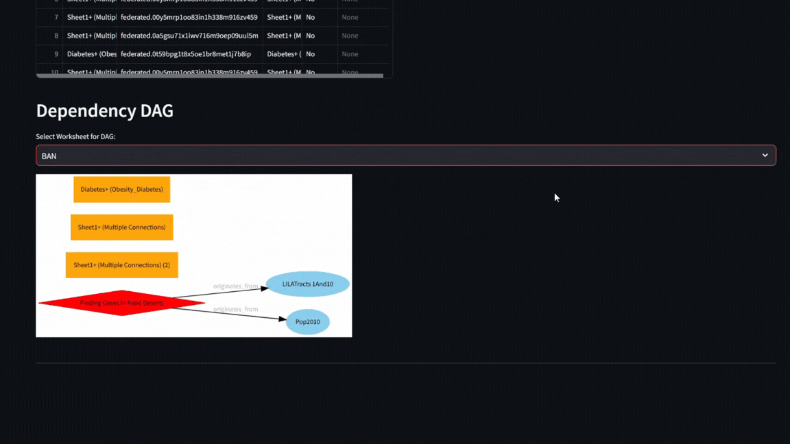

```markdown
# Tableau Report Gen

A Streamlit application to parse Tableau Workbook (`.twbx`) files and generate comprehensive reports, including version information, calculated fields, original fields, worksheets, data sources, and a Dependency DAG visualization.


## Table of Contents

- [Features](#features)
- [Demo](#demo)
  - [Public Tableau Reports](#public-tableau-reports)
- [Installation](#installation)
  - [System Dependencies](#system-dependencies)
  - [Python Package](#python-package)
- [Usage](#usage)
- [Development](#development)
  - [GitHub File Structure](#github-file-structure)
  - [Deployment to Test and Live PyPI](#deployment-to-test-and-live-pypi)
    - [Prerequisites](#prerequisites)
    - [Step 1: Build the Package](#step-1-build-the-package)
    - [Step 2: Upload to Test PyPI](#step-2-upload-to-test-pypi)
    - [Step 3: Test the Package](#step-3-test-the-package)
    - [Step 4: Upload to Live PyPI](#step-4-upload-to-live-pypi)
    - [Notes](#notes)
  - [Setting Up CI/CD Pipeline with GitHub Actions](#setting-up-cicd-pipeline-with-github-actions)
  - [Developer Contact](#developer-contact)
- [License](#license)

## Features

- **Upload Tableau Workbook:** Easily upload your `.twbx` files.
- **Comprehensive Reports:** Generate detailed reports covering various aspects of your workbook.
- **Dependency DAG:** Visualize dependencies between calculated fields and original columns.
- **Export Options:** Download reports in HTML or PDF formats.



### Public Tableau Reports

Here are some public Tableau reports compatible with our application:

1. [Finding Oases In Food Deserts](https://public.tableau.com/app/profile/corey.jones/viz/FindingOasesInFoodDeserts/Dashboard1)
2. [Choose Background Color](https://public.tableau.com/app/profile/ritesh.bisht/viz/ChooseBackgroundColor_16843492447710/Improved_UI_2)
3. [State Medigap Costs](https://public.tableau.com/app/profile/lindsay.betzendahl/viz/StateMedigapCosts-ProjectHealthViz/Medigap)

## Installation

### System Dependencies

This package requires [Graphviz](https://graphviz.org/) to be installed on your system.

- **Windows:**
  - Download the installer from the [Graphviz Download Page](https://graphviz.org/download/) and follow the installation instructions.
  - Ensure that the `bin` directory (e.g., `C:\Program Files\Graphviz\bin`) is added to your system's `PATH`.

- **macOS:**
  Install Graphviz via Homebrew:
  ```bash
  brew install graphviz
  ```

- **Linux:**
  Install Graphviz via APT:
  ```bash
  sudo apt-get install graphviz
  ```

### Python Package

**Note:** This package **only supports Python version `3.12` and above.** Please ensure you are using a compatible Python version.

Install the package using `pip`:

```bash
pip install tableau-report-gen
```

## Usage

After installation, you can run the Streamlit app via the command line:

```bash
trggo
```

This will launch the app in your default web browser. Follow the on-screen instructions to upload your `.twbx` file and generate reports.

## Development

This section provides an overview of the project's file structure, deployment processes, CI/CD pipeline setup, and developer contact information.

### GitHub File Structure

Understanding the repository's file structure is essential for effective development and collaboration. Below is a breakdown of the key files and directories:

```plaintext
build/
tableau_parser_app/
├── app.py
├── components/
│   └── uploader.py
├── parser/
│   └── tableau_parser.py
├── utils/
│   ├── dag.py
│   ├── helpers.py
│   └── report.py
├── logs/
.gitignore
Dockerfile
LICENSE
pyproject.toml
README.md
requirements.txt
setup.py
```

- **build/**: Contains build artifacts and compiled files.
- **tableau_parser_app/**: Main application directory.
  - **app.py**: Entry point of the Streamlit application.
  - **components/**: Reusable UI components.
    - **uploader.py**: Handles file upload functionality.
  - **parser/**: Modules related to parsing Tableau workbooks.
    - **tableau_parser.py**: Core parser logic for `.twbx` files.
  - **utils/**: Utility scripts and helper functions.
    - **dag.py**: Generates Dependency DAG visualizations.
    - **helpers.py**: Contains helper functions used across the app.
    - **report.py**: Manages report generation and export.
- **logs/**: Directory for log files.
- **.gitignore**: Specifies files and directories to be ignored by Git.
- **Dockerfile**: Configuration for Docker containerization.
- **LICENSE**: Licensing information.
- **pyproject.toml**: Project metadata and build configuration.
- **README.md**: Project documentation.
- **requirements.txt**: Python dependencies required for the project.
- **setup.py**: Setup script for packaging and distribution.

## Deployment to Test and Live PyPI

Deploying your package to PyPI involves two main steps: publishing to Test PyPI for testing purposes and then to the Live PyPI for public distribution.

### Prerequisites

- Ensure you have an account on [PyPI](https://pypi.org/) and [Test PyPI](https://test.pypi.org/).
- Install necessary tools:
  ```bash
  pip install setuptools twine
  ```

### Step 1: Build the Package

Navigate to the root directory of your project and run:

```bash
python setup.py sdist bdist_wheel
```

This command generates the source distribution and wheel files in the `dist/` directory.

### Step 2: Upload to Test PyPI

```bash
twine upload --repository-url https://test.pypi.org/legacy/ dist/*
```

- **Username and Password:** You'll be prompted to enter your Test PyPI credentials.

### Step 3: Test the Package

Install the package from Test PyPI to ensure it's working as expected:

```bash
pip install --index-url https://test.pypi.org/simple/ tableau-report-gen
```

### Step 4: Upload to Live PyPI

Once testing is successful, upload the package to the live PyPI:

```bash
twine upload dist/*
```

- **Username and Password:** Enter your PyPI credentials when prompted.

### Notes

- **Versioning:** Increment the package version in `setup.py` before each upload to avoid conflicts.
- **Automation:** Consider automating the deployment process using CI/CD pipelines (see next section).

### Setting Up CI/CD Pipeline with GitHub Actions

*Coming Soon*

### Developer Contact

*Coming Soon*

## License

This project is licensed under the MIT License - see the [LICENSE](LICENSE) file for details.